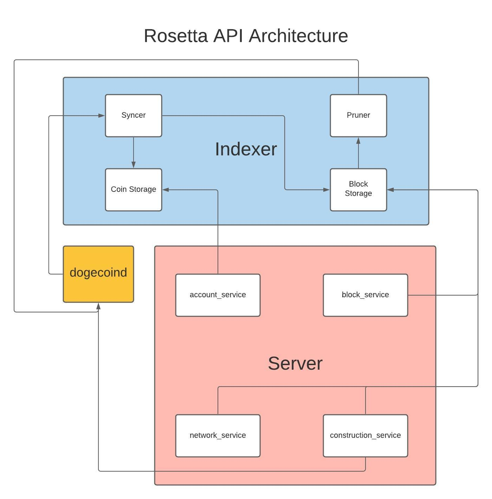

Dogecoin Rosetta API implementation
====================================

<p align="right">
<a href="https://github.com/rosetta-dogecoin/rosetta-dogecoin/actions/workflows/ci.yml"></a>
<a href="https://raw.githubusercontent.com/rosetta-dogecoin/rosetta-dogecoin/main/LICENSE.txt"></a>
</p>


<p align="center"><b>
ROSETTA-DOGECOIN IS UNDER INITIAL DEVELOPMENT AND IF IT IS NOT BROKEN, THIS IS ACCIDENTAL.
DO NOT USE THIS SOFTWARE, YET.
</b></p>


## Overview
`rosetta-dogecoin` provides an implementation of the Rosetta API for
Dogecoin in golang, based off the [rosetta-bitcoin](https://github.com/coinbase/rosetta-bitcoin)
reference implementation provided by Coinbase. If you haven't heard of the
Rosetta API, you can find more information [here](https://rosetta-api.org).


## Usage
As specified in the [Rosetta API Principles](https://www.rosetta-api.org/docs/automated_deployment.html),
all Rosetta implementations must be deployable via Docker and support running via either an
[`online` or `offline` mode](https://www.rosetta-api.org/docs/node_deployment.html#multiple-modes).

**YOU MUST INSTALL DOCKER FOR THE FOLLOWING INSTRUCTIONS TO WORK. YOU CAN DOWNLOAD
DOCKER [HERE](https://www.docker.com/get-started).**

### Install
Running the following commands will create a Docker image called `rosetta-dogecoin:latest`.

#### From GitHub
To download the pre-built Docker image from the latest release, run:
```text
curl -sSfL https://raw.githubusercontent.com/rosetta-dogecoin/rosetta-dogecoin/master/install.sh | sh -s
```
_Do not try to install rosetta-dogecoin using GitHub Packages!_

#### From Source
The following command will build a Docker image named `rosetta-dogecoin:latest` in the root directory of the project.

```text
make build-local
```

### Run
Running the following commands will start a Docker container in
[detached mode](https://docs.docker.com/engine/reference/run/#detached--d) with
a data directory at `dogecoin-data/` and the Rosetta API accessible
at port `8080` for **online** modes and `8081` for **offline** modes..

*You can list your running containers by running `docker container ls`.*

#### Mainnet:Online
`make run-mainnet-online`

#### Mainnet:Offline
`make run-mainnet-offline`

#### Testnet:Online
`make run-testnet-online`

#### Testnet:Offline
`make run-testnet-offline`


## Testing

We use [`rosetta-cli`](https://github.com/coinbase/rosetta-cli) to ensure we maintain [Rosetta API](https://www.rosetta-api.org/docs/welcome.html) standards.

## Target Architecture
`rosetta-dogecoin` plans to use the `syncer`, `storage`, `parser`, and `server` package
from [`rosetta-sdk-go`](https://github.com/coinbase/rosetta-sdk-go).



## Performance and Efficiency

### Use a 64-bit architecture
`rosetta-bitcoin` uses [memory-mapped files](https://en.wikipedia.org/wiki/Memory-mapped_file) to
persist data in the `indexer`. As a result, you **must** run `rosetta-bitcoin` on a 64-bit
architecture (the virtual address space easily exceeds 100s of GBs).

### Increase swap
If you receive a kernel OOM, you may need to increase the allocated size of swap space
on your OS. There is a great tutorial for how to do this on Linux [here](https://linuxize.com/post/create-a-linux-swap-file/).

### Optimizations
* Automatically prune dogecoind while indexing blocks
* Reduce sync time with concurrent block indexing
* Use [Zstandard compression](https://github.com/facebook/zstd) to reduce the size of data stored on disk
without needing to write a manual byte-level encoding


## Development

All Rosetta implementations must be deployable via Docker and support running via either [`online` or `offline` mode](https://www.rosetta-api.org/docs/node_deployment.html#multiple-modes).

However, if you prefer not to use Docker during development in your own fork (e.g for low-end machines), feel free to follow the instructions in the **Without Docker** section.

### With Docker

* `make deps` to install dependencies
* `make test` to run tests
* `make lint` to lint the source code
* `make salus` to check for security concerns
* `make build-local` to build a Docker image from the local context
* `make coverage-local` to generate a coverage report

### Without Docker

#### Dependencies

Download and install the latest (current **1.16.2**) version of Go.

https://golang.org/doc/install

#### Build

`go build`

#### Running

`make run-testnet-online`

## Testing

To validate `rosetta-dogecoin`, [install `rosetta-cli`](https://github.com/coinbase/rosetta-cli#install)
and run one of the following commands:
* `rosetta-cli check:data --configuration-file rosetta-cli-conf/testnet/config.json`
* `rosetta-cli check:construction --configuration-file rosetta-cli-conf/testnet/config.json`
* `rosetta-cli check:data --configuration-file rosetta-cli-conf/mainnet/config.json`

## License
This project is available open source under the terms of the [Apache 2.0 License](https://opensource.org/licenses/Apache-2.0).

rosetta-bitcoin is © 2020 Coinbase
